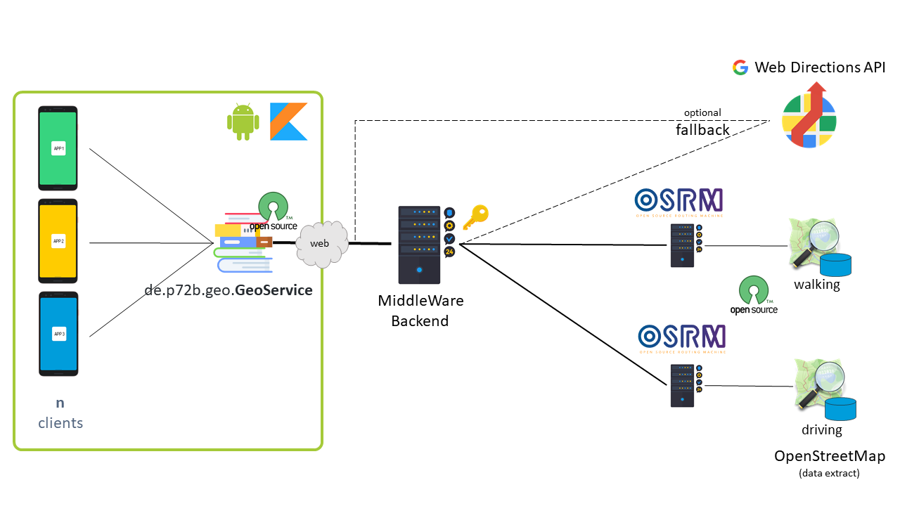
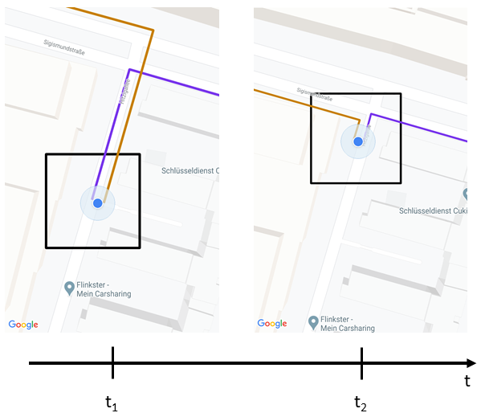
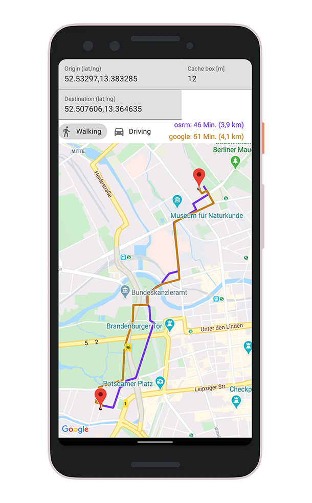

# geo-library

A module to help abstracting directions calls to google web API or custom self hosted directions resolving backend for example a OSRM service. See chart below to get a usage impression. The GeoService is part of the library.



Library Dependencies:
- Retrofit2 with rxjava2:rxkotlin is used
- play-services-maps is consumed

Benefits:
- walking/driving directions supported
- BoxCaching available by default

## Requirements

Library: No google API key is required. The library can be used starting at:
- MinSdk 16 (Android 4.1)

Demo App: Android google maps key and google web directions api key is required. OSRM sample server runs on https://p72b.de/geo/ and can deliver directions results for berlin only. App runs on:
- MinSdk 21 (Android 5.0)

## BoxCache

Is a caching system based on a extended squared box of the origin and destination location specified by a given param in meters. In the figure shown below at t1 there was a directions request made. As long as the user (e.g. origin here) deosn't leave the black square there will be no additional directions request made until t2 is reached.

Benefits:
- Reducing amount of requests made
- Less battery consumption
- buffers location updates (example usecase)
- flexable box size definition by given param

Visualisation of the caching used inside the GeoService. Dynamic visualization available inside the demo app.



## Download

Check out the <a href="https://jitpack.io/#P72B/geo-library" download>lib version on JitPack</a>

## Library Sample App

To build the demo app there is an android google maps key needed. Place the key inside app/signing.properties file like this:
```
GOOGLE_MAPS_API_KEY=key_here
STORE_FILE_DEBUG=some_file_here.keystore
STORE_PASSWORD_DEBUG=some_password
KEY_ALIAS_DEBUG=some_name
KEY_PASSWORD_DEBUG=some_password
STORE_FILE_RELEASE=some_file_here.keystore
STORE_PASSWORD_RELEASE=some_password
KEY_ALIAS_RELEASE=some_name
KEY_PASSWORD_RELEASE=some_password
```

Also a google directions API key is required to setup the demo properly. Create a file SecuredConstants.kt in app/src/main/java/de/p72b/geo/demo/util and place the web api key like:
```
class SecuredConstants {
    companion object {
        const val GOOGLE_MAPS_WEB_API_KEY = "YOUR_KEY_HERE"
    }
}
```

[2020/07/21]